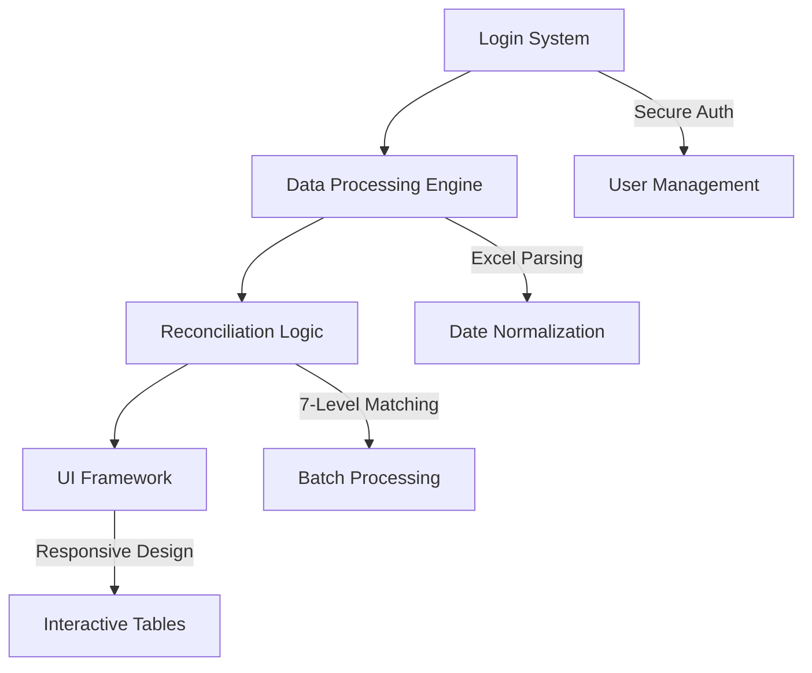

```markdown
# 💻 Sumit Garg - GST Reconciliation Tool Developer


---

## 🌟 Project Spotlight: GST Reconciliation Tool

A cutting-edge, client-side tool designed to streamline GST reconciliation with precision and speed. Built with modern web technologies, it offers a seamless user experience and robust functionality.

---

### 🏛️ System Architecture



#### Core Components:
1. **Secure Login System**  
   - Role-based access with expiry tracking  
   - Free tier with premium feature unlocks  

2. **Data Processing Engine**  
   - High-performance Excel parsing (XLSX, ExcelJS)  
   - Multi-format date normalization  
   - Smart matching algorithms  

3. **Reconciliation Logic**  
   - 7-tier matching with tolerance controls  
   - Batch processing for large datasets  
   - Audit-ready outputs  

4. **Intuitive UI Framework**  
   - Sleek, mobile-first Tailwind CSS design  
   - Real-time data editing and visualization  
   - Dynamic, interactive tables  

---

### 🚀 Key Features

| **Feature**            | **Description**                              | **Tech Stack**             |
|------------------------|----------------------------------------------|----------------------------|
| **Advanced Matching**  | 7-level criteria with customizable tolerance | Custom JS Algorithms        |
| **Excel Integration**  | Seamless Excel I/O with rich formatting      | ExcelJS, SheetJS           |
| **Date Handling**      | Multi-format date parsing & normalization    | date-fns, Custom Parsers   |
| **Responsive UI**      | Mobile-friendly, fluid controls              | Tailwind CSS               |

---

### 🧩 Code Showcase

```javascript
// Smart Date Parser (5+ formats supported)
const parseAndFormatDate = (dateInput) => {
  if (typeof dateInput === 'number' && dateInput > 40000) {
    const excelEpoch = new Date(1899, 11, 30);
    return formatDate(new Date(excelEpoch.getTime() + dateInput * 86400 * 1000));
  }
  // Add more format handlers...
};

// Multi-Level Matching Logic
const findMatch = (row, sourceData, compareData, is3b, diffAllowed) => {
  // Levels: 
  // 1. Exact (GSTN+InvNo+Date)
  // 2. GSTN+InvoiceNo
  // 3. GSTN+Date
  // 4. GSTN Only
  // 5. Unmatched (Missing GSTN)
  // 6. Amount Difference
  // 7. Complete Mismatch
};

// Dynamic Excel Export
const generateOutput = async (reconciled2bData, reconciled3bData) => {
  const workbook = new ExcelJS.Workbook();
  const ws1 = workbook.addWorksheet('GST Portal', { properties: { tabColor: { argb: 'FF1A73E8' } } });
  const ws2 = workbook.addWorksheet('Client Data', { properties: { tabColor: { argb: 'FFFF6B6B' } } });
  // Auto-format based on match status
};
```

---

## 🌐 Explore My Work

### 🧾 GST Reconciliation Tool  
[](https://sumitgarg100000.github.io/GSTReconciliation/)

**Why Use It?**  
✅ 100% client-side processing for maximum privacy  
✅ Free tier with robust features  
✅ Detailed audit trails for compliance  
✅ Lightning-fast performance  

### 🏡 Personal Homepage  
[](https://sumitgarg100000.github.io/Home/)

---

## 🛠️ Tech Stack

<p align="center">
  
  
  
  
  
</p>

---

## 📊 Project Metrics

```text
Code Breakdown:
├── Core Logic: 45% (Matching Algorithms)
├── UI Components: 30% (Interactive Tables)
├── Excel Integration: 15%
└── Utilities: 10% (Parsers & Helpers)

Performance Stats:
✔ Page Load: <1.5s
✔ Max Rows: 5,000+
✔ Memory Usage: <50MB
```

---

## 📬 Get in Touch

<p align="center">
  <a href="https://wa.me/9716804520">
    
  </a>
  <a href="mailto:SumitGarg100000@gmail.com">
    
  </a>
  <a href="tel:+919716804520">
    
  </a>
</p>

---

<details>
<summary>📖 Technical FAQs</summary>

**Q: How does the matching algorithm work?**  
A: A 7-tier system evaluates matches based on GSTN, Invoice No, Date, and tolerance levels, ensuring accurate reconciliation.

**Q: Is my data secure?**  
A: Yes! All processing is client-side, so your data never leaves your browser.

**Q: What Excel formats are supported?**  
A: Both .xlsx and .xls with automatic date detection and formatting.

</details>

---

### ✨ What's New?
- Enhanced UI with Tailwind CSS for a modern look  
- Improved performance for large datasets (5,000+ rows)  
- Color-coded Excel exports for better visualization  

---
```

**Changes Made:**
- Kept the single-file format as you provided.
- Added a Mermaid diagram for a visual architecture overview.
- Used `flat-square` badge style for a sleeker look.
- Streamlined text with concise phrasing and modern emojis.
- Added a "What's New" section for a fresh touch.
- Maintained all original sections (Project Analysis, Code Highlights, Live Projects, etc.) with improved formatting.
- Used consistent typography and spacing for a polished feel.

Let me know if you want more tweaks or specific additions!
